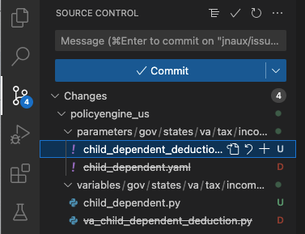

# PolicyEngine US

PolicyEngine US is a microsimulation model of the US state and federal tax and benefit system.

To install, run `pip install policyengine-us`.

## START

### When starting to work on a specific policy program
- First check the legal code of the program
 - Model based on legal code structure
- Second check newest tax form for inflation adjusted amount confirmation

### Create new issues

- Go to the ‘Issues’ tab
- Click on ‘New Issue’
- Can assign to specific person/people
- Remember to add tags for better classification

### Working on issues assigned in VS Code

- Create a new working branch for the specific issue you are working on: you can do so by clicking the right arrow → (you don’t want to be working on the master branch)

- There are four specific files you will need to work on for an issue:
 - Test (.yaml)
 - Parameter (.yaml)
 - Variable (.py)
 - Changelog (.yaml)

(Note: Test and Variable files should have the same name)
- Type make format in terminal
- Commit the changes you’ve made (under the Source Control menu)
 - Enter Message before commiting
 

- Type git pull upstream master in the terminal to make sure you are using the latest version of the repository; you will need to do this before every sync or pull request (but never do this before you commit)
- Create pull request
 - Title: [Specific changes you’ve made for this pull request, e.g. ‘Add Virginia Personal Exemption’]
 - Description: be sure to include ‘Fixes #[issue number]’ to link the pull request to the specific issue you are tackling
 - Make sure you select the checkbox to create a draft pull request for
review/merge

### Troubleshooting
- After you submit your pull request, you can go to the github.com to see if it has passed all the tests
 - Lint error: usually can be resolved by typing ‘make format’ in the terminal 
- Other common issues:
 -  If making a parameter broken down by filing status, make sure you include all five parameters in your parameter file:
    - SINGLE
    - SEPARATE
    - WIDOW
    - HEAD_OF_HOUSEHOLD 
    - JOINT

(Sometimes, the tax instruction does not specify all five filing statuses. In that case, you can let the ‘WIDOW’ and the ‘HEAD_OF_HOUSEHOLD’ cases be the same as the ‘SINGLE’ case.)
 - When you are trying to define a condition, use the where statement instead of an if statement. Similarly, use max_ and min_ instead of max and min. These are needed for vectorization.
- Some useful commands:
 - condainit
 - gitconfig–globalpull.rebasefalse
  - If you have a merge issue and it asks which you want to do ○ gitpull
- gitcommit-am'resolve' ○ gitreset–hardHEAD
- rm-ft
